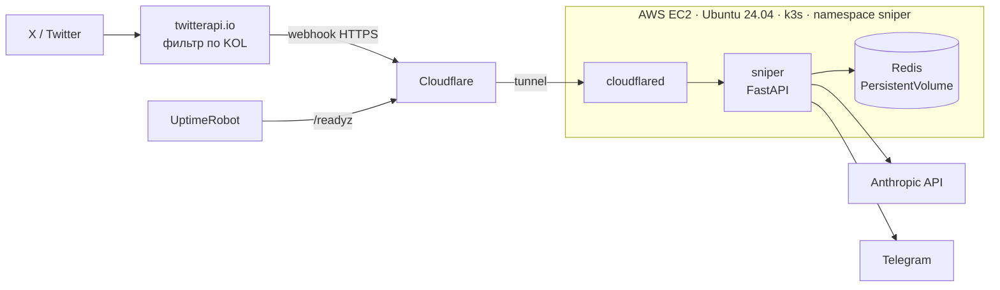

# Sniper Agent


Сервис алертов о новых крипто-токенах. В реальном времени получает твиты крипто-инфлюенсеров (KOL) из X, извлекает адреса контрактов, отсеивает шум с помощью LLM и отправляет алерты в Telegram.

Проект развёрнут как DevOps-кейс: инфраструктура описана кодом (Ansible + манифесты Kubernetes), сервис работает в **k3s на AWS EC2**, тесты и сборка образа идут в **GitHub Actions**, трафик приходит через **Cloudflare Tunnel** без открытых входящих портов, доступность проверяет внешний мониторинг.

## Архитектура



Путь твита внутри сервиса:

```
вебхук → парсинг адресов контрактов → дедупликация (Redis) → LLM-классификация → алерт в Telegram
```

## Как работает приложение

- **Вебхук.** twitterapi.io присылает новые твиты отслеживаемых аккаунтов. Эндпоинт защищён секретом в пути и сразу отвечает `200`, а обработка уходит в фон: провайдер ретраит вебхук по таймауту, и долгая обработка внутри запроса давала бы дубли.
- **Парсер.** Находит адреса Solana (base58) и EVM (`0x…`) в тексте и в ссылках (pump.fun, dexscreener и т.п., включая развёрнутые `t.co`), отбрасывает известные адреса вроде USDC.
- **Дедупликация в Redis.** Повторный вебхук с тем же твитом игнорируется. Для каждого адреса считается, сколько разных KOL его упомянули за окно: несколько упоминаний подряд — более сильный сигнал.
- **LLM-классификация.** Модель через Anthropic API определяет, колл это или обсуждение. Уверенные не-коллы отбрасываются, неуверенные всё равно отправляются. Если модель недоступна, алерт уходит без разбора: сервис не должен молчать.
- **Алерт.** Сообщение в Telegram с адресом, автором, переводом твита и кнопками для проверки токена.

## Стек

| Слой | Технологии |
|---|---|
| Приложение | Python 3.12, FastAPI, aiogram 3, httpx, Redis, Anthropic API |
| Контейнеры и оркестрация | Docker, Kubernetes (k3s) |
| Инфраструктура как код | Ansible |
| Облако и сеть | AWS EC2, Security Groups, ufw, Cloudflare Tunnel |
| CI/CD | GitHub Actions, GitHub Container Registry (GHCR) |
| Тесты и мониторинг | pytest, UptimeRobot |

## Инфраструктура

### Безопасность

- **Минимум открытых портов.** Входящим открыт только SSH (22) и только с IP администратора. Два слоя защиты: Security Group в AWS и `ufw` с политикой `deny incoming` на сервере.
- **Вебхуки через исходящий туннель.** `cloudflared` сам подключается к Cloudflare изнутри сервера, поэтому порты 80/443 не открыты вовсе.
- **SSH только по ключу**, вход под root запрещён.
- **Секреты не в репозитории.** `.env` в `.gitignore`; в кластере ключи хранятся в Kubernetes Secret, который создаётся на сервере. `cloudflared` получает только свой токен (`secretKeyRef`), а не все ключи.
- **Образ без секретов.** Образ собирается в CI из чистого checkout, где `.env` отсутствует.
- **IP сервера не публикуется:** в репозитории лежит только `inventory.example.ini`.

### Kubernetes

| Ресурс | Назначение |
|---|---|
| `Namespace sniper` | Все ресурсы проекта отдельно от служебных |
| `Deployment sniper` | Бот: 1 реплика, RollingUpdate (обновление без простоя), liveness `/healthz`, readiness `/readyz`, лимит памяти 512Mi |
| `Service sniper` | Постоянное имя `sniper:8080`, по нему туннель находит бота |
| `Deployment redis` | Redis 7 с AOF (`--appendonly yes`), стратегия Recreate (один под на одном диске), readiness `redis-cli ping`, лимит памяти 128Mi |
| `Service redis` | Имя `redis:6379` внутри кластера, снаружи недоступен |
| `PersistentVolumeClaim redis-data` | Диск 1Gi (`local-path`), данные переживают перезапуск пода и сервера |
| `Deployment cloudflared` | Туннель: токен из Secret, liveness по `/ready` на порту метрик |
| `Secret sniper-env` | Ключи из `.env`; создаётся на сервере, в репозитории отсутствует |

### CI/CD

```
git push
  └─ GitHub Actions
       ├─ pytest — 33 теста, без сети (модель, Redis и Telegram подменены фейками)
       └─ только ветка main и только если тесты прошли:
            сборка образа → GHCR (:latest и :<sha коммита>)
ansible-playbook deploy.yml
  └─ обновление манифестов и Secret → rollout restart → rollout status
```

- Окружение CI закреплено (`ubuntu-24.04`), чтобы сборка не ломалась от чужих обновлений.
- Тег `:<sha>` позволяет точно сказать, из какого коммита собран образ, и откатиться на прошлую версию.
- `rollout status` роняет деплой, если новая версия не прошла readiness за 2 минуты.

### Мониторинг

- `/healthz` — процесс жив (liveness).
- `/readyz` — сервис готов работать: проверяет Redis командой `PING` с таймаутом 2 секунды и отвечает `503`, если Redis недоступен (readiness). Поддерживает `GET` и `HEAD`.
- **UptimeRobot** раз в 5 минут проверяет `/readyz` снаружи, через интернет, и присылает оповещение при сбое. Так ловятся и падение бота, и проблемы с сервером или туннелем.

## Структура репозитория

```
.
├── app/                      # код сервиса
│   ├── main.py               # FastAPI: /webhook, /healthz, /readyz
│   ├── parser.py             # поиск адресов контрактов
│   ├── dedup.py              # дедупликация и счётчики в Redis
│   ├── analyst.py            # LLM-классификация
│   ├── notifier.py           # алерты в Telegram
│   ├── pipeline.py           # сборка шагов в пайплайн
│   └── providers/            # клиент twitterapi.io
├── tests/                    # pytest
├── k8s/                      # манифесты Kubernetes
│   ├── namespace.yaml
│   ├── redis.yaml
│   ├── sniper.yaml
│   └── cloudflared.yaml
├── ansible/                  # инфраструктура как код
│   ├── base.yml              # Docker, ufw, защита SSH
│   ├── k3s.yml               # установка k3s
│   ├── deploy.yml            # деплой в кластер
│   ├── ansible.cfg
│   └── inventory.example.ini
├── .github/workflows/
│   └── tests.yml             # тесты + сборка образа
├── Dockerfile
├── docker-compose.yml        # локальный запуск
└── requirements.txt
```

## Развёртывание с нуля

**Что нужно заранее:**
- сервер Ubuntu 24.04 (проект работает на AWS EC2 t3.small, 2 ГБ RAM) и SSH-ключ к нему;
- Ansible на машине администратора (Linux или WSL);
- домен в Cloudflare и named tunnel с маршрутом на `http://sniper:8080`;
- заполненный `.env` (см. ниже).

**Шаги:**

```bash
cd ansible
cp inventory.example.ini inventory.ini   # вписать IP сервера
# в deploy.yml указать repo_url и путь к локальному .env (local_env)

ansible-playbook base.yml     # Docker, ufw, защита SSH
ansible-playbook k3s.yml      # установка k3s
ansible-playbook deploy.yml   # Secret, манифесты, запуск сервиса
```

**Проверка:**

```bash
kubectl get pods -n sniper                  # три пода Running 1/1
curl https://sniper.<ваш-домен>/readyz      # {"status":"ok"}
```

Все плейбуки идемпотентны: повторный запуск ничего не ломает, а приводит сервер к описанному состоянию.

## Переменные окружения

| Переменная | Назначение |
|---|---|
| `TWITTERAPI_KEY` | Ключ API twitterapi.io |
| `WEBHOOK_SECRET` | Секрет в пути вебхука `/webhook/<secret>` |
| `TELEGRAM_TOKEN` | Токен Telegram-бота |
| `TELEGRAM_CHAT_ID` | Чат для алертов |
| `ANTHROPIC_API_KEY` | Ключ Anthropic API; без него LLM-разбор отключается и уходят все алерты |
| `REDIS_URL` | Адрес Redis, `redis://redis:6379/0` |
| `TUNNEL_TOKEN` | Токен Cloudflare Tunnel |

## Локальный запуск

```bash
docker compose up --build   # нужен .env
pytest -v
```

## Что можно улучшить

- Деплоить по тегу `:<sha>` вместо `:latest`, чтобы версия в кластере была зафиксирована явно.
- Автоматический деплой из GitHub Actions после сборки образа.
- Хранение логов дольше жизни пода (Loki + Grafana).
- Шифрованные секреты в репозитории (Sealed Secrets или SOPS).
- Закрепить версию образа `cloudflared`.
